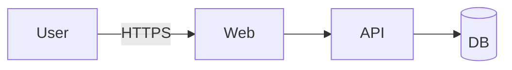
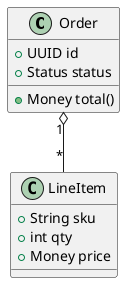

# Software Best Practices – Project Guide and Architecture

This repository collects practical patterns, diagrams, and automation scripts to help teams ship better software. It includes:

- A quick reference for diagramming with Mermaid and PlantUML
- Repeatable GitHub Actions to auto-generate simple Mermaid diagrams from source
- Example C4 architecture diagrams (Context, Container, Component, and Code level)
- Lightweight Python utilities for bootstrapping and diagram generation

If you want the big picture fast, jump to Architecture at a glance below and the C4 diagrams in `diagrams/`.

---

## Table of Contents

1. Executive Summary
2. Getting Started
3. Project Layout
4. Running Locally
5. Diagramming – Why, What, and How
6. Architecture at a Glance (C4)
7. Deep Dive: Context (Level 1)
8. Deep Dive: Containers (Level 2)
9. Deep Dive: Components (Level 3)
10. Deep Dive: Code (Level 4)
11. Docs vs Diagrams: Why C4 First
12. CI/CD – Auto-generating Diagrams
13. Style, Linting, and Quality Gates
14. Roadmap & Next Steps
15. Appendix: Quick References

---

## 1. Executive Summary

This repo demonstrates how to keep architecture and docs close to code, and how to make them easy to consume. The approach centers around C4 diagrams to communicate the system at increasing levels of detail, and small automation to keep simple docs up to date.

Key ideas:

- Start with C4 diagrams to orient readers, then link to deeper docs.
- Prefer short, scannable diagrams for stakeholders and new contributors.
- Automate what’s easy: e.g., generate simple Mermaid diagrams from code.
- Keep everything in the repo (diagrams, scripts, workflows), not in wikis.

---

## 2. Getting Started

Requirements for local diagram preview:

- VS Code (recommended)
- Mermaid: built-in Markdown preview
- PlantUML: install a PlantUML extension; some features may require Graphviz

To preview PlantUML files:

- Open the `.puml` file and start the PlantUML preview (often Alt+D)
- Or open a Markdown file and render Mermaid code fences

---

## 3. Project Layout

```
.
├─ app.py                         # Example app module
├─ diagrams/
│  ├─ ref.md                      # Mermaid & PlantUML quick reference
│  ├─ webapp-flow-c4.puml         # Sample C4 container diagram
│  ├─ c4/                         # Local C4-PlantUML includes
│  │  ├─ C4_Context.puml
│  │  ├─ C4_Container.puml
│  │  ├─ C4_Component.puml
│  │  └─ C4_Deployment.puml
│  ├─ c4-context.puml             # New: Context diagram (Level 1)
│  ├─ c4-container.puml           # New: Container diagram (Level 2)
│  ├─ c4-component.puml           # New: Component diagram (Level 3)
│  └─ c4-code.puml                # New: Code-level diagram (Level 4)
├─ scripts/
│  └─ gen_mermaid.py              # Generates simple Mermaid diagrams from app.py
└─ .github/
   └─ workflows/
      └─ generate-mermaid.yml     # CI workflow to generate Mermaid and open a PR
```

---

## 4. Running Locally

Generate the simple Mermaid diagrams from `app.py`:

```bash
python3 scripts/gen_mermaid.py
```

This produces:

- `diagrams/generated/app_structure.mmd` – a class diagram
- `diagrams/generated/app_structure.md` – a Markdown file with inline Mermaid

Preview any `.puml` file with your PlantUML plugin (some may require Graphviz).

---

## 5. Diagramming – Why, What, and How

- Why: Diagrams are fast to scan, capture intent, and align teams quickly.
- What: Use Mermaid for quick Markdown-friendly diagrams, PlantUML for richer UML or C4.
- How: Co-locate diagrams with code and automate generation where possible.

References:

- Quick reference: `diagrams/ref.md`
- C4 overview: https://c4model.com/

---

## 6. Architecture at a Glance (C4)

- Context (Level 1): Who uses the system and what other systems exist?
- Containers (Level 2): What deployable/runtime units comprise the system?
- Components (Level 3): How does a container decompose into components?
- Code (Level 4): Optional class-level view; lowest value to keep updated.

Diagrams in this repo:

- Context: `diagrams/c4-context.puml`
- Container: `diagrams/c4-container.puml` and `diagrams/webapp-flow-c4.puml`
- Component: `diagrams/c4-component.puml`
- Code: `diagrams/c4-code.puml`

---

## 7. Deep Dive: Context (Level 1)

Audience: Executives, PMs, stakeholders, new engineers

What it shows:

- The system as a box, with users (people) and external systems
- Relationships at a high level

Where to look:

- `diagrams/c4-context.puml`

---

## 8. Deep Dive: Containers (Level 2)

Audience: Engineers, architects, SREs

What it shows:

- The containers (deployables): Browser, API, Services, Databases, etc.
- Protocols and important connections (HTTPS, REST, gRPC, SQL)

Where to look:

- `diagrams/c4-container.puml`
- `diagrams/webapp-flow-c4.puml`

---

## 9. Deep Dive: Components (Level 3)

Audience: Engineers who maintain/extend a container

What it shows:

- How a container (e.g., Order Service) is composed from internal components
- Example: API layer, Application layer, Domain layer, Data access

Where to look:

- `diagrams/c4-component.puml`

---

## 10. Deep Dive: Code (Level 4)

Audience: Engineers in implementation work

What it shows:

- Classes, interfaces, and relationships (very detailed)
- Often volatile; don’t obsess over keeping it perfectly updated

Where to look:

- `diagrams/c4-code.puml`

---

## 11. Docs vs Diagrams: Why C4 First

Long READMEs are helpful for details but are hard to skim and easy to go stale. C4 addresses this by giving the reader a layered path:

1) Context: “What is this thing and who uses it?”
2) Containers: “What are the major building blocks and how do they connect?”
3) Components: “How is a specific container structured internally?”
4) Code: “What are the classes and functions?”

This reduces onboarding time, accelerates architecture reviews, and makes design changes easier to communicate.

Still write docs, but lead with diagrams. Use links from diagrams to sections in the README for deeper reading.

---

## 12. CI/CD – Auto-generating Diagrams

The workflow `.github/workflows/generate-mermaid.yml` runs on pushes to `app.py` and can:

- Generate a simple Mermaid class diagram and routes overview (if Flask-style routes are detected)
- Optionally ask GitHub Copilot CLI to produce a Mermaid flowchart summary
- Open a pull request with any new diagrams under `diagrams/generated/`

This lowers the effort to keep simple visualization assets updated.

---

## 13. Style, Linting, and Quality Gates

- Keep Mermaid and PlantUML files tidy (no tabs; blank lines around headings in Markdown)
- Prefer small, focused diagrams – if it’s dense, split it
- Treat diagrams as code: PRs, reviews, and CI checks apply

---

## 14. Roadmap & Next Steps

- Add deployment views and runtime sequence diagrams for critical flows
- Enrich code generation for diagrams (e.g., detect frameworks beyond Flask)
- Integrate with architecture review templates and ADRs

---

## 15. Appendix: Quick References

### Mermaid – Flowchart cheat



### PlantUML – C4 Container cheat

```plantuml
@startuml
!include ./diagrams/c4/C4_Container.puml
Person(user, "User")
System_Boundary(sys, "System") {
  Container(web, "Web App", "React", "UI")
  Container(api, "API", "Node", "Endpoints")
  ContainerDb(db, "DB", "Postgres", "Data")
}
Rel(user, web, "Uses")
Rel(web, api, "Calls")
Rel(api, db, "Reads/Writes")
@enduml
```

### PlantUML – Class cheat



---

### Final note

Diagrams should tell a story. If yours doesn’t, it’s too busy or not focused on a decision. Trim, annotate, and link to the next level of detail.
