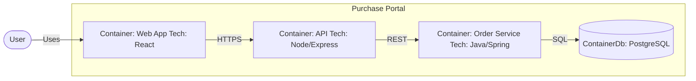

```mermaid
flowchart LR
  user([User])

  subgraph "Purchase Portal"
    web[Container: Web App Tech: React]
    api[Container: API Tech: Node/Express]
    svc[Container: Order Service Tech: Java/Spring]
    db[(ContainerDb: PostgreSQL)]
  end

  user -->|Uses| web
  web -->|HTTPS| api
  api -->|REST| svc
  svc -->|SQL| db
```