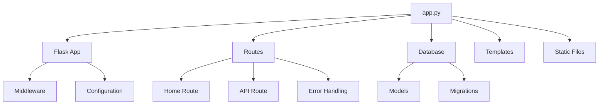

```mermaid
flowchart TD
    A[app.py] --> B[Flask App]
    A --> C[Routes]
    C --> D[Home Route]
    C --> E[API Route]
    C --> F[Error Handling]
    A --> G[Database]
    G --> H[Models]
    G --> I[Migrations]
    A --> J[Templates]
    A --> K[Static Files]
    B --> L[Middleware]
    B --> M[Configuration]
```
