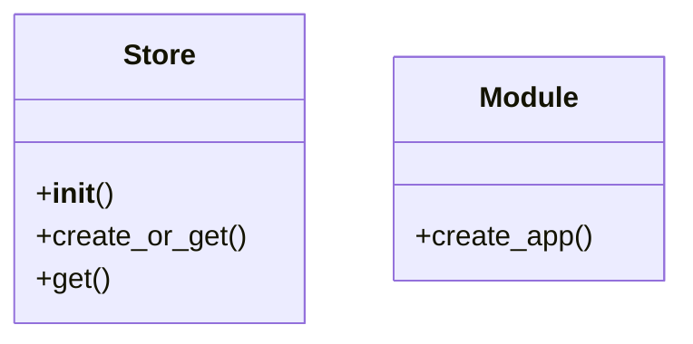

# App structure diagrams (auto-generated)

## Class diagram

```mermaid
%% Autogenerated by scripts/gen_mermaid.py
classDiagram
  class Store {
    +__init__()
    +create_or_get()
    +get()
  }
  class Module { 
    +create_app()
  }
```

