# Modeling examples: UML, ERD, DFD, and State Machines

This file shows small, copyable examples for common diagram types. Each section includes a short explanation and at least one diagram sample (Mermaid-first; PlantUML where valuable).

---

## UML basics: structural vs behavioral

- Structural: what the system is (static) — e.g., Class diagrams.
- Behavioral: what the system does (dynamic) — e.g., Sequence, Activity, State.

Tip: Use Sequence/Activity for flows; Class for data/structure; State for lifecycles.

---

## UML — Sequence (behavioral)

### Mermaid (sequence)

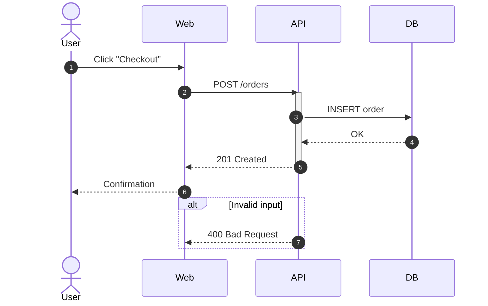

### PlantUML (sequence)

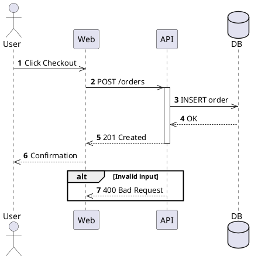

---

## UML — Class (structural)

### Mermaid (class)

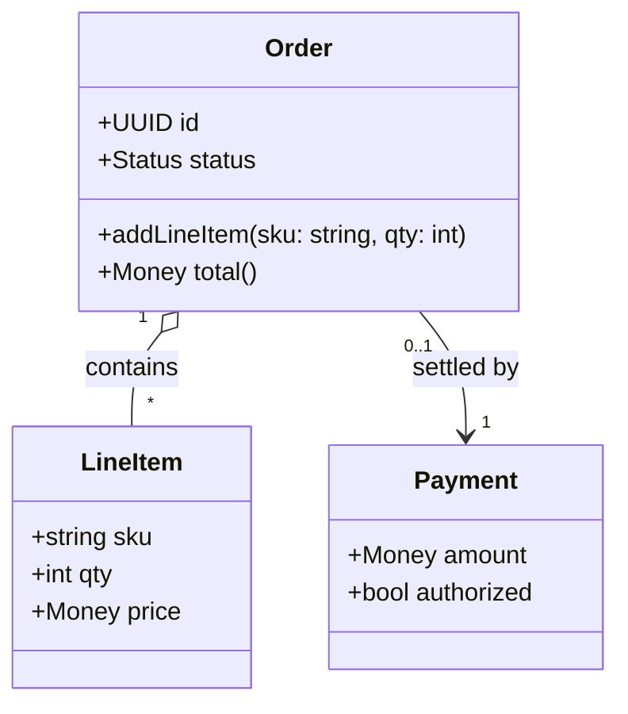

### PlantUML (class)

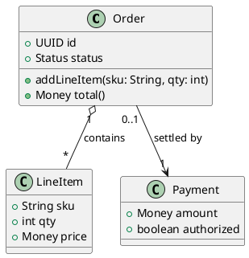

---

## UML — State (behavioral)

### Mermaid (state)

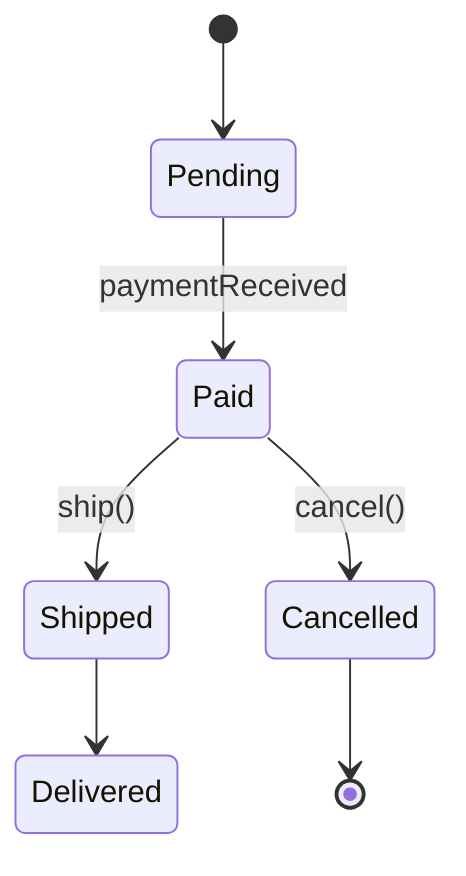

### PlantUML (state)

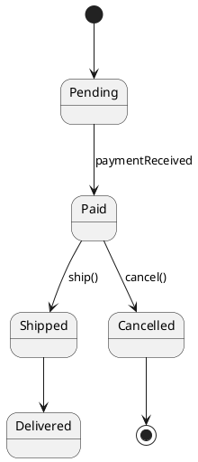

---

## UML — Activity (behavioral)

### Mermaid (flowchart approximation)

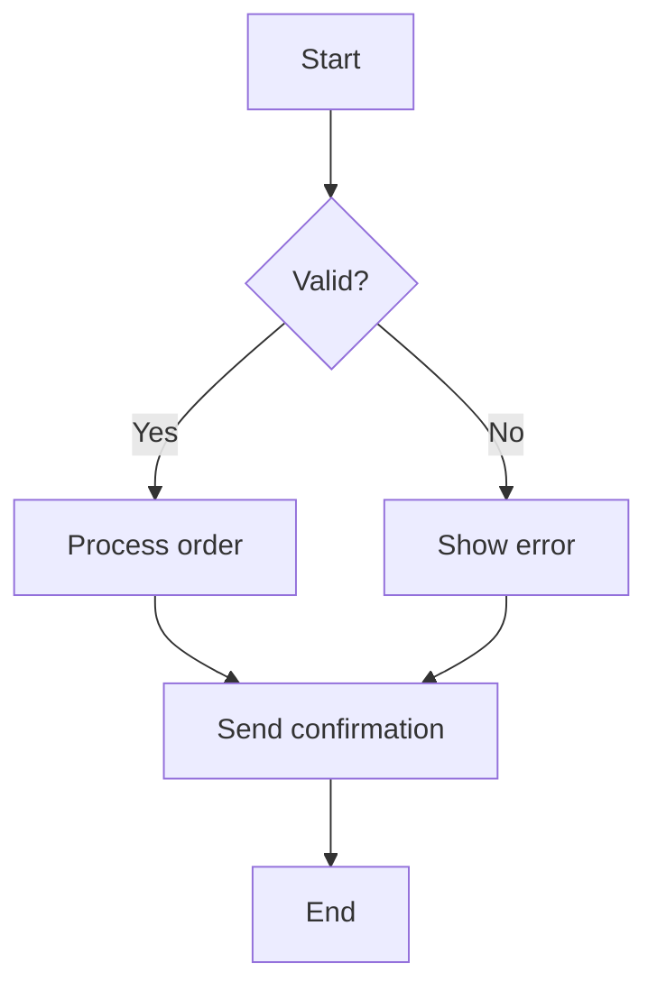

### PlantUML (activity)

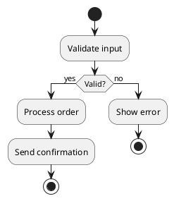

---

## ERD — Entities, relationships, cardinality

### Mermaid ER

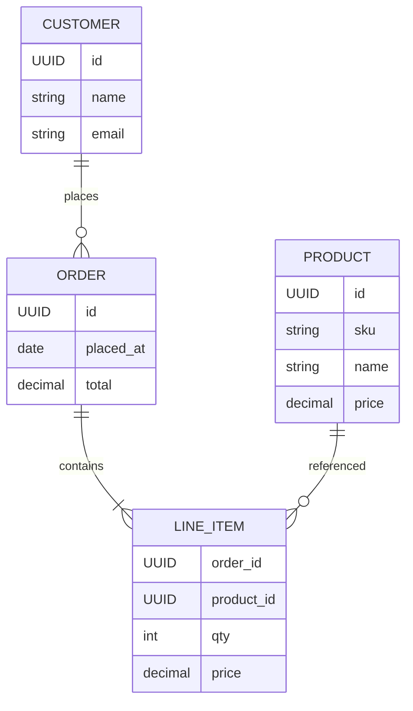

Notes

- Cardinality: `||` one, `o{` zero-or-many, `|{` one-or-many.
- Normalization vs pragmatism:
  - Normalization reduces duplication (e.g., product name/price live in PRODUCT).
  - Pragmatism may de-normalize for performance or historical accuracy (e.g., copy price into LINE_ITEM). Document why.

---

## Data Flow Diagram (DFD) — Sources/sinks, processes, data stores, trust boundaries

Mermaid doesn’t have a native DFD, but you can approximate with flowchart shapes and subgraphs labeled as trust boundaries.

### Mermaid (DFD approximation)

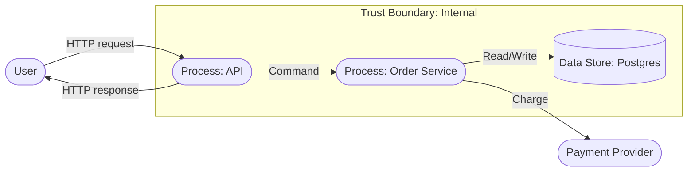

Legend

- Sources/sinks: rounded rectangles ([User])
- Processes: rounded rectangles labeled `Process:`
- Data stores: cylinder `[(...)]`
- Trust boundaries: subgraphs labeled accordingly

---

## State machines — Lifecycle and invariants

Pick critical domain objects (e.g., Order) and encode their lifecycle and invariants.

### Mermaid — Order lifecycle with invariants

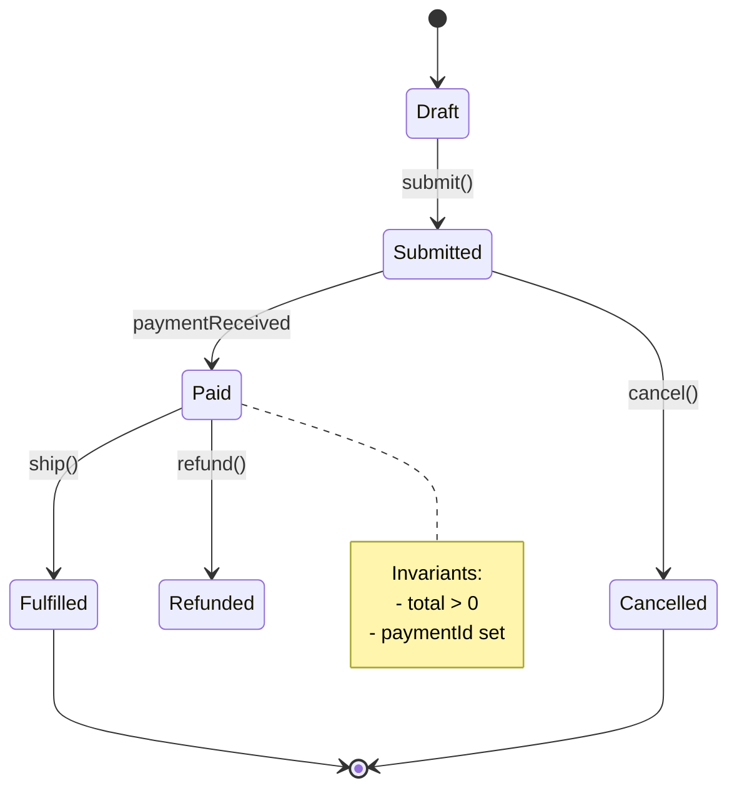

Guidance

- Keep states mutually exclusive and exhaustive where possible.
- Attach invariants to states where they hold.
- Transitions should be triggered by events or commands and be auditable.
