# Software Diagramming Quick Reference - Mermaid & PlantUML

Purpose: paste, tweak, and render the most common diagram types in Markdown (Mermaid) and PlantUML. Use VS Code’s Markdown preview for Mermaid; use a PlantUML extension for PlantUML.

Tip: Keep each statement on its own line in sequence diagrams. Do not mix Mermaid syntax inside PlantUML blocks (and vice versa).

---

## Copy & adapt templates

### Microservice request flow (Mermaid sequence)
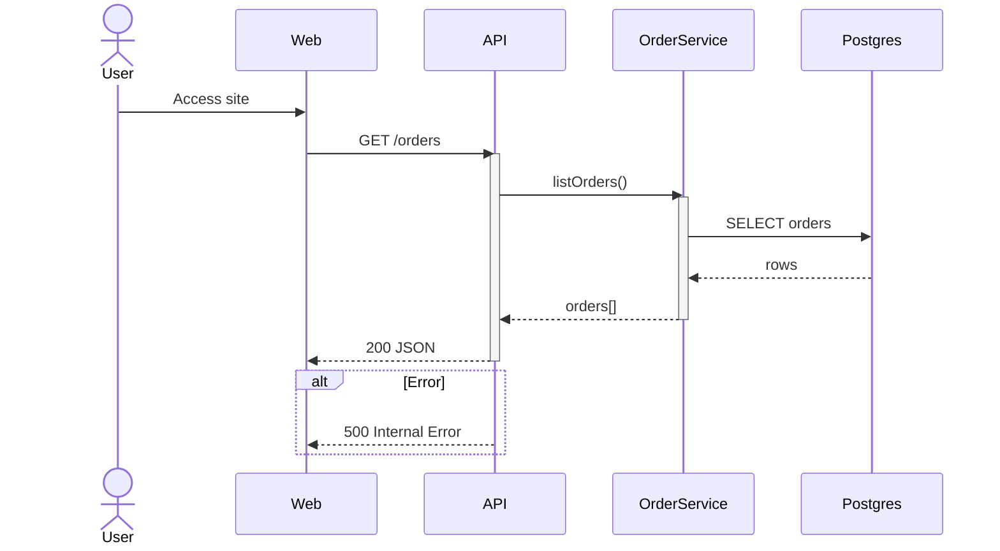

### Microservice request flow (PlantUML sequence)
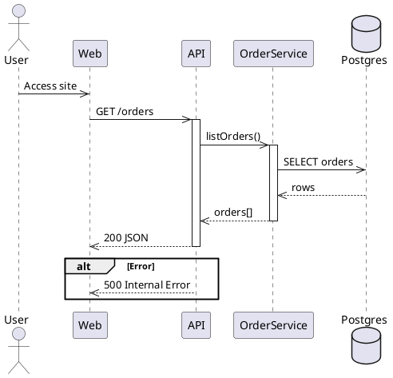

### Layered architecture (Mermaid flowchart)
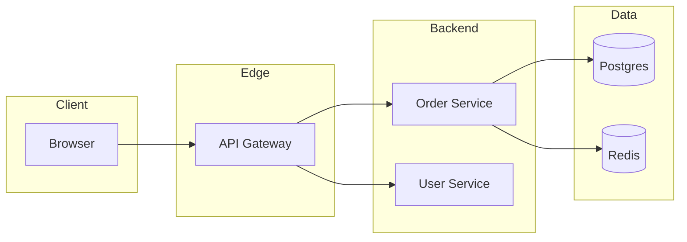

### Layered architecture (PlantUML component)
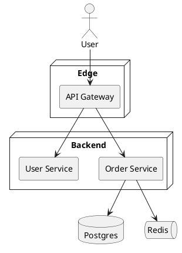

### Domain aggregate (Mermaid class)
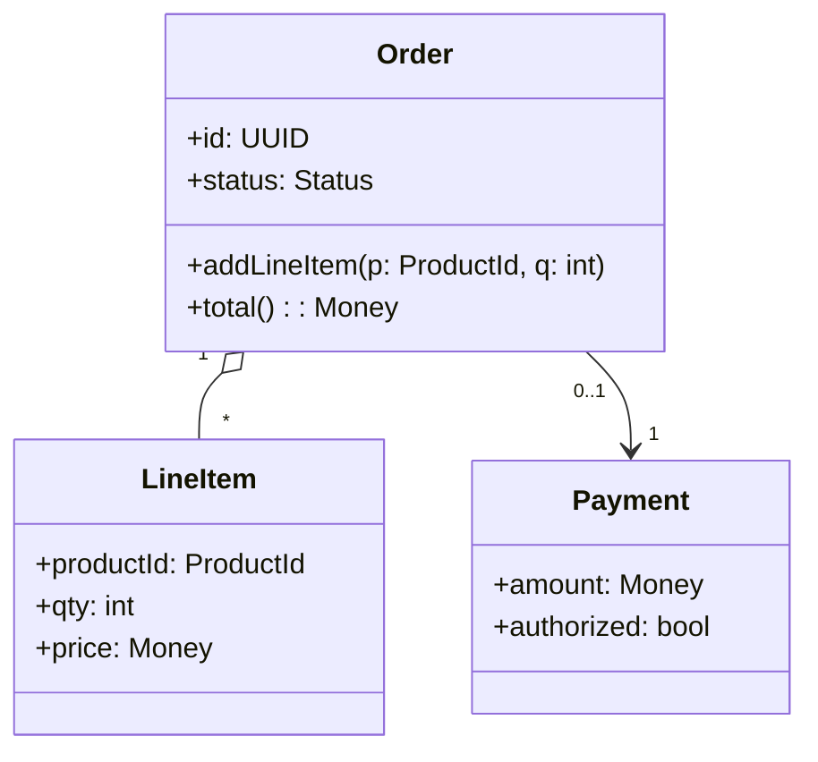

### Domain aggregate (PlantUML class)
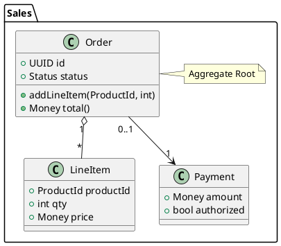

### C4 container view (PlantUML via C4-PlantUML)
Requires internet or local includes.
```plantuml
@startuml
' Option A: remote include (internet required)
!includeurl https://raw.githubusercontent.com/plantuml-stdlib/C4-PlantUML/master/C4_Container.puml

' Option B: local include
' !include ./C4_Container.puml

Person(user, "User")
System_Boundary(sys, "Purchase Portal") {
  Container(web, "Web App", "React", "Serves UI")
  Container(api, "API", "Node/Express", "REST endpoints")
  ContainerDb(db, "DB", "PostgreSQL", "Stores data")
}
Rel(user, web, "Uses")
Rel(web, api, "Calls")
Rel(api, db, "Reads/Writes")
@enduml
```

### C4-like container view (Mermaid approximation)
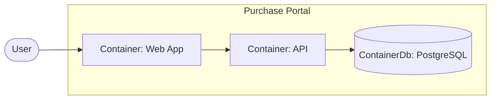

---

## Mermaid quick reference

- Use fenced code blocks with ```mermaid in Markdown.

### Flowchart
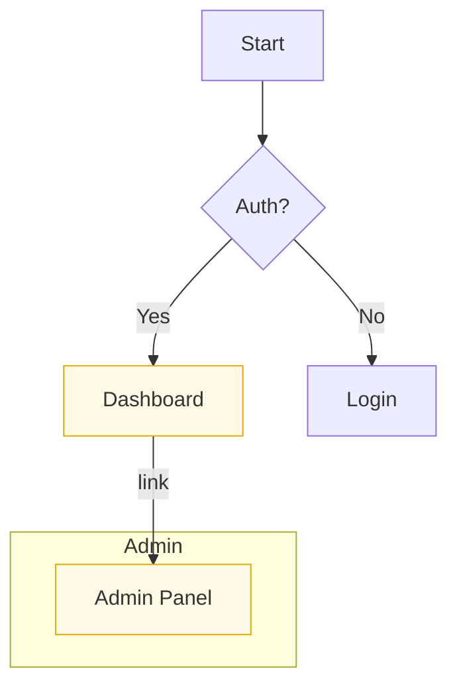

### Sequence
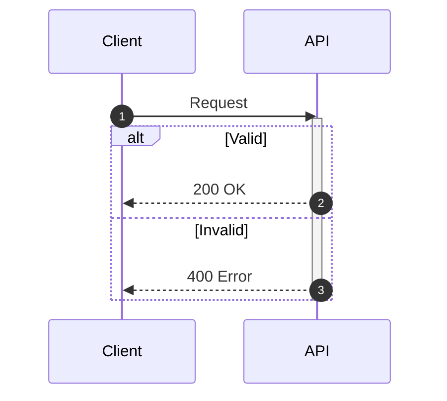

### Class
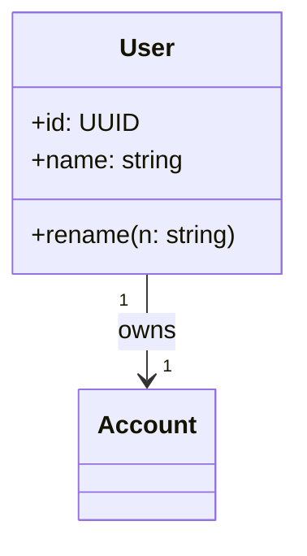

### State
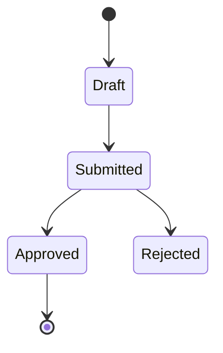

### ER (Entity-Relationship)
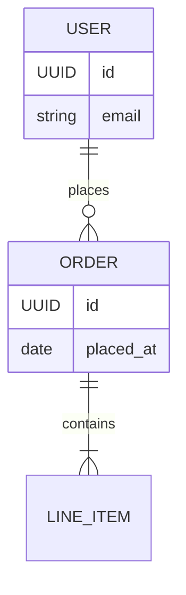

### Gantt
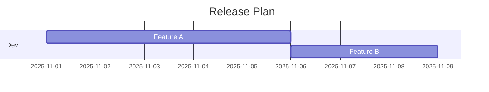

Tips
- Directions: TD, LR, BT, RL control flowchart layout.
- Styling: classDef + class to style nodes.
- Links: click A "https://example.com" "Open" in flowcharts.
- Sequence: keep each actor/message on its own line; use alt/opt/loop.

---

## PlantUML quick reference

- Use fenced code blocks with ```plantuml in Markdown.
- Most diagram types start with @startuml and end with @enduml.

### Sequence
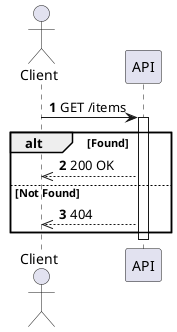

### Class
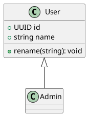

### Component
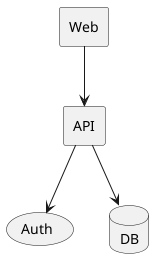

### Use Case
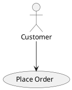

### Activity
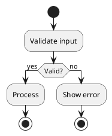

### State
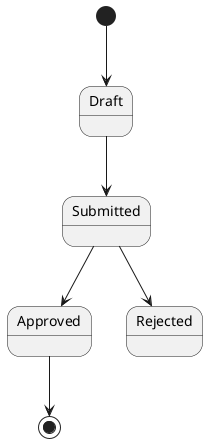

### Deployment
```plantuml
@startuml
node "Kubernetes" {
  node "Pod" {
    component API
  }
}
database Postgres
API --> Postgres
@enduml
```

Tips
- Themes: try !theme blueprint, or skinparam for fine-grained styling.
- strictuml: add !pragma strictuml for stricter validation.
- Graphviz: some diagrams/renderers require Graphviz installed.

---

## VS Code tips

- Preview Mermaid: open Markdown file, press Ctrl+Shift+V.
- Preview PlantUML: install "PlantUML" extension; open the PUML block and start preview (Alt+D in many setups). Graphviz may be required for some renderers.
